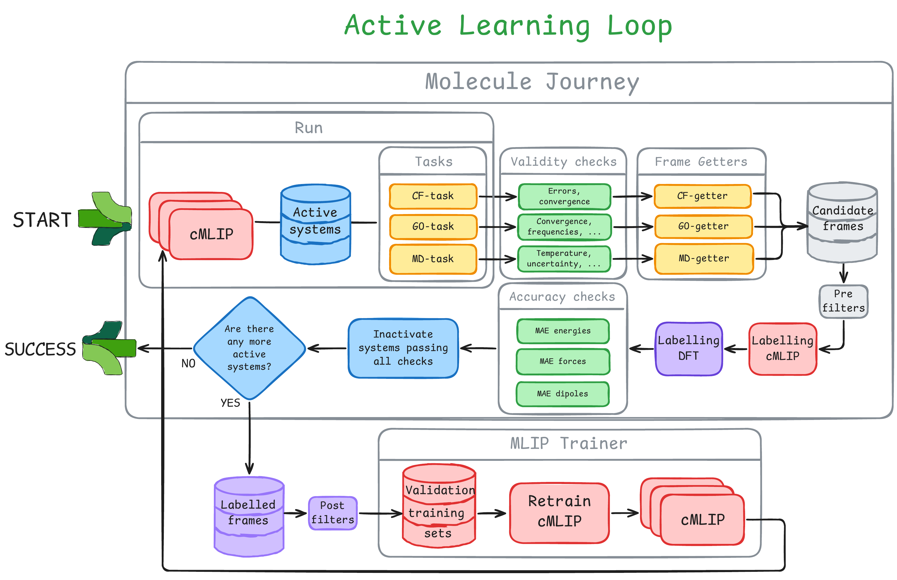

## Contributing

### Testing

Add `active_learning/.env` file with:
```
AMSBASHRCPATH="path/to/amsbashrc.sh"
SCM_PYTHONDIR=".amspy"
```

Test recipes are present in the [justfile](./justfile) ([just-github](https://github.com/casey/just)).

Run all the tests:
```
just test
```

### Concepts

The detailed procedure in which the active learning loop follow is:

<div style="text-align: center;">
  
</div> 

Note: this image might NOT be up to date, the implementation of the `ActiveLearningLoop` is in [loop.py](src/scm/active_learning/loop/loop.py) and [iteration_state.py](src/scm/active_learning/loop/iteration_state.py).

`ActiveLearningLoop` class is the center of this project/package.

#### Mutable ActiveLearningLoop

`ActiveLearningLoop` class is a MUTABLE BaseModel class. It's attributes can and will change. To follow along the muting states logging to json or other format the `ActiveLearningLoop` class is advised. Therefore its initial state is what it can be considered a "settings" class, and what follow are "settings" for the next step during the loop.

#### Realtive/absolute paths

`ActiveLearningLoop` can be serialized to json. Therefore you can load/save it easly. But what happends if you want to move your simulation folder to another device? You need to change all the paths to relative... But I am sure some apps to run need absolute paths to work. Therefore:
- the json file saves all the paths relative to the json file position
- when we load `ActiveLearningLoop` from the json file all the paths are converted to absolute
but which path? You have to specify them! in `src/scm/active_learning/logging/json_paths.py` there is a `PATH_POLICY_REGISTRY` to be modified whis some regex rules based on the settings nested keys of the json file to define which values to change. That's what I came up with.