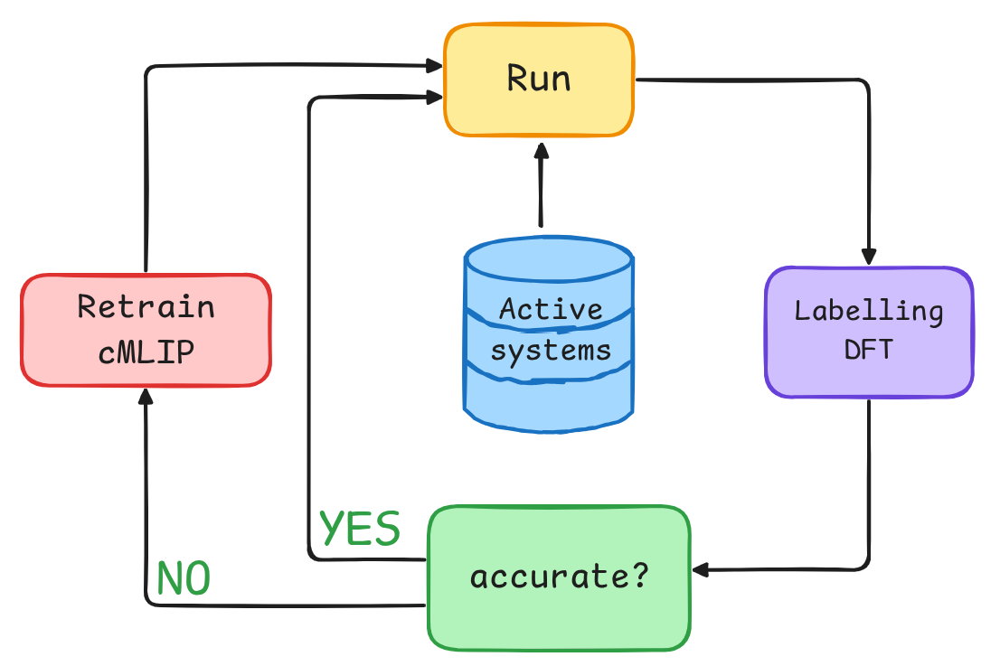

## Active Learning

Test0 | Name: test-amspy, on 2026-09-24 | Coverage: 74.8% | Tests:  7 failed, 325 passed, 262 warnings in 67.37s (0:01:07) 

Test1 | Name: test-extras, on 2026-09-24 | Coverage: 70.6% | Tests:  4 failed, 293 passed, 10 skipped, 189 warnings in 38.11s 

Test2 | Name: test-base, on 2026-09-24 | Coverage: 69.5% | Tests:  3 failed, 288 passed, 16 skipped, 188 warnings in 7.68s 

This package has as its core the implementation of active learning workflows for atomistic systems. It automate data generation and ML training. Favouring fast implementation of expert specific tasks based MLIP training/Data collection (Conformers, PES exploration, Diffusion mechanisms,...).

Objectives:
- abstraction for easy task implementation (MD, Harmonic IR, Conformers, PES exploration, Diffusion mechanisms,...)
- abstraction for workflow progress, in what is called journey scheduler.
- unified inspection of results

What this package does not care:
- implementation of MLIPs should be provided and not implemented internally.

<div style="text-align: center;">
  
</div> 


## Environment setup

Run the commands below from the [active_learning](/active_learning/) folder.

> **SCM credentials:** Installing the AMS extra requires valid SCM credentials for the
> SCM package index. If you do not have credentials yet, request a free trial at
> [www.scm.com/free-trial](http://www.scm.com/free-trial).

Authenticate uv with the SCM package index, then create the environment with the AMS and MACE extras:

```bash
"$AMSBIN/uv" auth login "https://downloads.scm.com/Downloads/packages/uv/channels/2026.1/simple/"
uv lock --upgrade
uv sync --extra ams --extra mace
```

`uv run` uses the workspace environment, so activation is not required.


## Tutorials

To run the notebooks:

```bash
uv run --all-extras -m jupyterlab tutorials/notebooks
```

### AMS-free ASE smoke test

Run [`sal0_smoke_test.py`](tutorials/scripts/sal0_smoke_test.py) for a small three-iteration active-learning loop without an AMS executable or AMS package channel. It runs periodic Ar molecular dynamics and reference energy/force labelling with ASE Lennard-Jones, then trains a one-epoch CPU MACE model.

```bash
uv sync --extra mace
uv run tutorials/scripts/sal0_smoke_test.py
```

The run writes timestamped results under `ALruns/`.

### ALIR YAML experiments

The YAML configurations live in [`tutorials/yamls`](tutorials/yamls/). Replace every `??to/be/filled??` value with a real, writable path before starting. The `base_dir` and `mlip_trainer.data.folder` values must be writable output locations. For each non-baseline experiment, set `start_engine.calculator_kwargs.model_paths` to the three trained committee model files that initialise it.

Start with [`alir_a_smoke.yaml`](tutorials/yamls/alir_a_smoke.yaml). It is a CPU, single-process, two-iteration run: the first iteration creates a MACE model and the second fine-tunes it. It writes removable results under `tutorials/yamls/tutorial_smoke_runs/`.

- `alir_a_smoke.yaml`: recommended end-to-end starting point.
- `alir_baseline.yaml`: baseline data-generation and training run.
- `alir_st.yaml`, `alir_mt.yaml`, `alir_mt_filter.yaml`, and `alir_mt_filter_stop.yaml`: amino-acid experiments that require an existing committee.
- `alir_mt_aadp.yaml`: dipeptide experiment that requires an existing committee.

Run the smoke configuration:

```bash
uv run al run tutorials/yamls/alir_a_smoke.yaml
```

Validate a YAML configuration without starting a run:

```bash
uv run al validate tutorials/yamls/alir_a_smoke.yaml
```

The command loads the complete active-learning model, including path resolution and Pydantic validation, but performs no simulation or training work.

After it completes, use `alir_baseline.yaml` for the full baseline experiment.

To resume an interrupted run, pass its saved state file:

```bash
uv run al run /path/to/run/al_state.yaml --resume
```

These runs can be computationally expensive. Choose output locations and `maxjobs`, `nproc`, and `device` values suitable for the machine before starting.

#### State snapshot format

Active-learning state snapshots use YAML by default. To write the start, iteration, and final snapshots as JSON instead,
configure the folder callback with `FolderManagerCallback(state_format="json")`. The `al run`, `al plot`, and `al copy`
commands accept both JSON and YAML state files; existing JSON snapshots remain compatible.

## Plotting a saved run

Use `al plot` with the saved YAML state file to generate the analysis PDF:

```bash
uv sync --extra viz --inexact
uv run al plot /path/to/run/al_state.yaml
```

## Contributing

Contributions are welcome. See [CONTRIBUTING.md](./CONTRIBUTING.md) for details.
