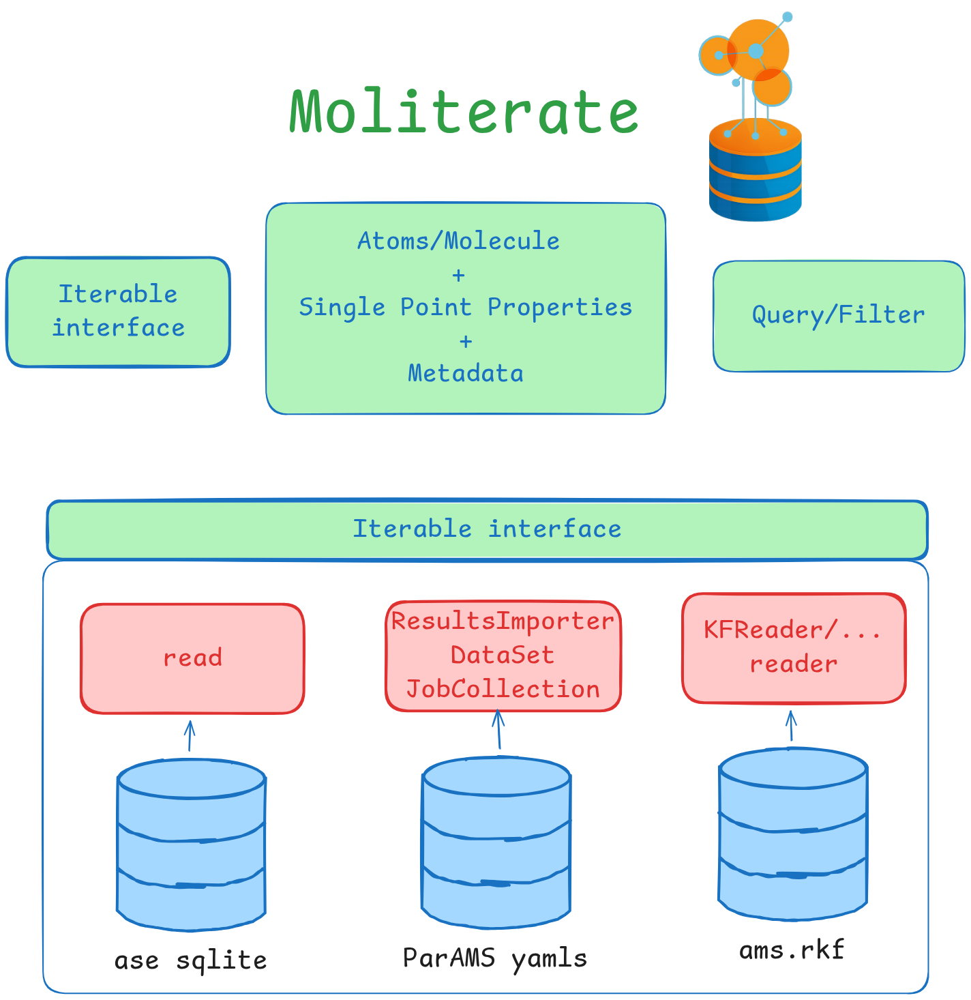

## MolIterate

Test0 | Name: test-amspy, on 2026-09-24 | Coverage: 85.4% | Tests:  6 failed, 234 passed, 1 skipped, 9 warnings in 33.81s 

Test1 | Name: test-extras, on 2026-09-24 | Coverage: 78.4% | Tests:  5 failed, 217 passed, 16 skipped, 400 warnings in 21.70s 

Test2 | Name: test-base, on 2026-09-24 | Coverage: 72.0% | Tests:  204 passed, 34 skipped, 319 warnings in 4.82s 

This package has as its core the treatment of many instances of this class `MolDataRow`, collect it, get access to it, inspect collection of it.
Objectives:
- `MolDataRow`core class : atoms, metadata and single point results are together
- integration on multiple data sources
- easy to inspect property presence
- modular filters
- classes should be JSON compatible (except for `MolDataRow`)

What `MolIterate` does not care:
- performance. Since it is influenced on which implementation sits on top.

<div style="text-align: center;">
  
</div>

## Example

```python
from scm.moliterate import load_dataset, ChemDataEntry
from scm.moliterate.filters import RandomFilter
# load iterable
ds = load_dataset(path)

# read one entry
entry: ChemDataEntry = ds[0]
entry.system: ase.Atoms
entry.properties: Dict[str, Any]
entry.metadata: Dict[str, JsonValue]

# read many entries
for entry in ds:
    ...

# concatenate
dss = load_dataset([path, path2])

# filter
filter_call = RandomFilter(num_samples=3)
dss_subset = filter_call(dss)
```

## Tutorials

Installation instructions for linux and who is using amspython:

```bash
cd /path/to/active_learning_workspace/moliterate
source /path/to/amsbashrc.sh
export SCM_PYTHONDIR=$(pwd)/.amspy
amspython -m pip install --upgrade pip
amspython -m pip install uv
amspython -m uv pip install -e .[chem,apricot,tutorial]
amspython -m uv pip install "plams @ git+https://github.com/SCM-NV/PLAMS"
```

Then run:
```bash
amspython -m jupyterlab
```

Look at some tutorials (in increasing order of complexity):

- [quick-overview.ipynb](tutorials/quick-overview.ipynb)
- [core-moliterate-concepts.ipynb](tutorials/core-moliterate-concepts.ipynb)
- [advanced-features-filters.ipynb](tutorials/advanced-features-filters.ipynb)
- [advanced-create-an-interface.ipynb](tutorials/advanced-create-an-interface.ipynb)


## Contributing

Contributions are welcome. See [CONTRIBUTING.md](./CONTRIBUTING.md) for details.
